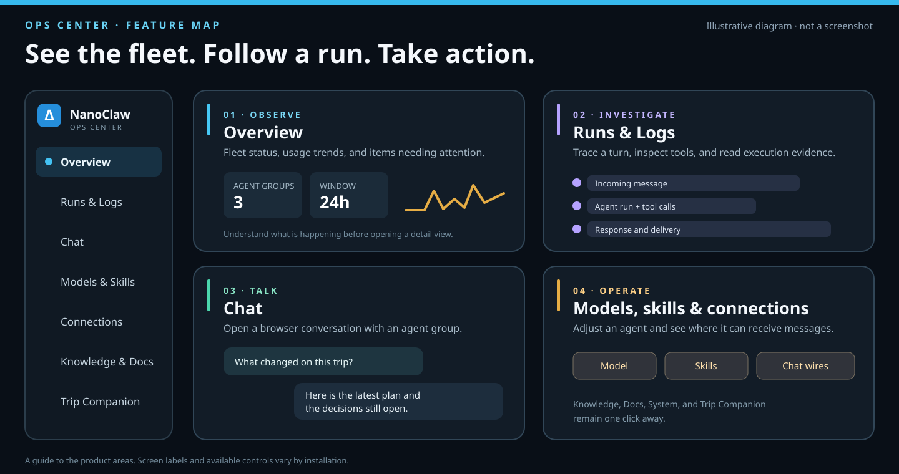
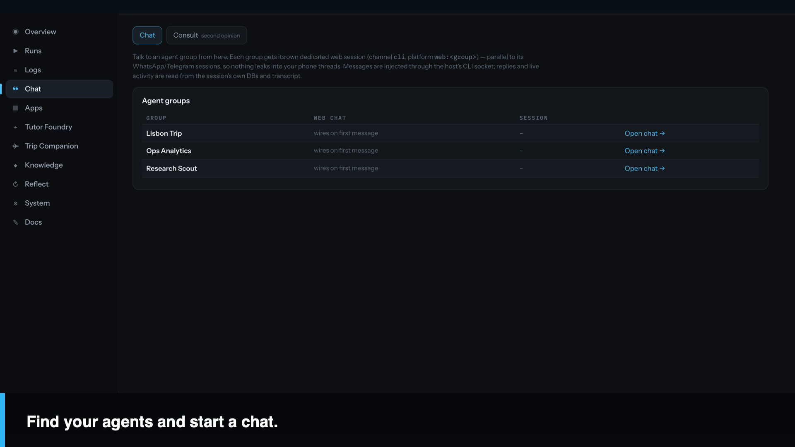
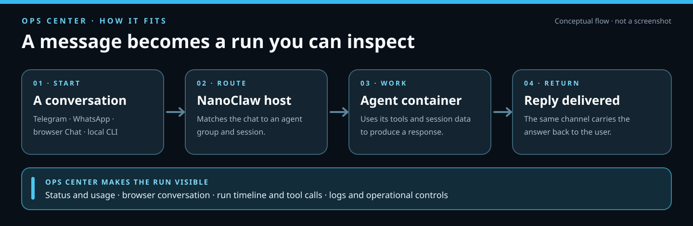
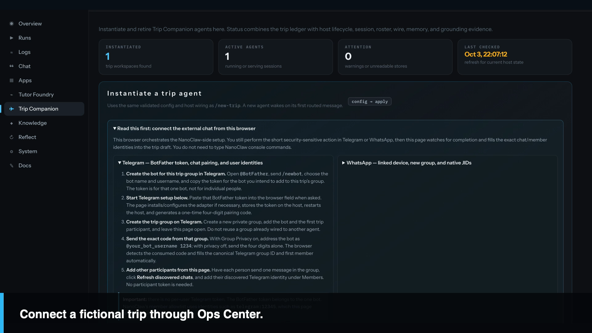
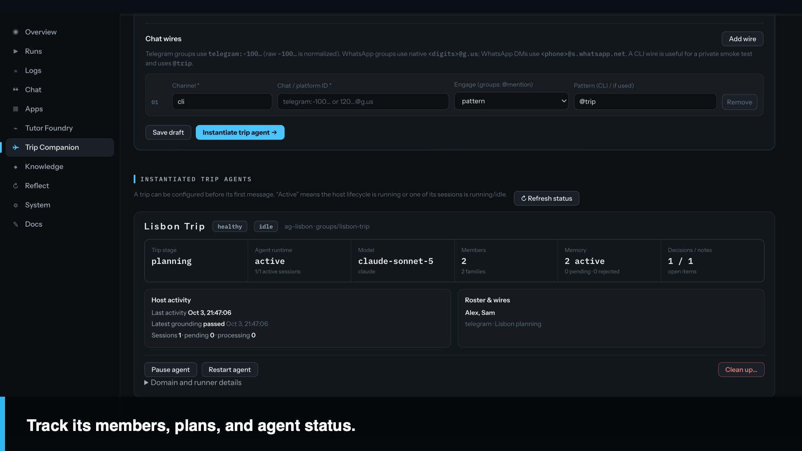
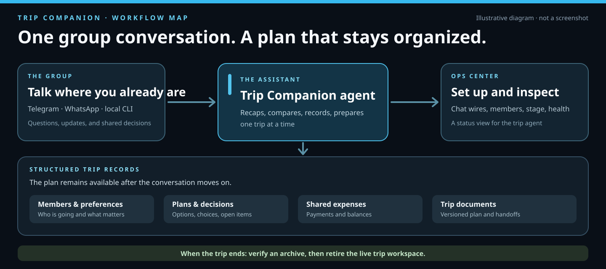

# Visual tour: Ops Center and Trip Companion

This page shows what the two additions to NanoClaw look like and how they fit
together. Screenshots are stills from an isolated Ops Center installation
seeded with fictional agents and trip data. The diagrams are conceptual guides,
not screenshots or a promise that every installation has the same status.

[Watch the 30-second video](media/nanoclaw-demo.mp4) ·
[Read its captions](media/nanoclaw-demo.vtt)

## Ops Center

### See where to go

Ops Center groups the everyday work of running agents in one browser UI.
**Overview** brings together fleet activity, usage, and attention signals.
**Runs** and **Logs** show execution evidence. **Chat** opens a browser
conversation with an agent group. Model, skill, connection, knowledge, document,
and system views provide the related controls and context.

### Open a conversation

The real Chat view below shows three fictional agent groups. Selecting **Open
chat** starts a browser conversation with that group; its messaging-platform
sessions remain separate.

### Follow what happened

A message reaches the host through a connected channel or browser Chat. The
host routes it to a session agent container and delivers the response through
the same channel. Ops Center shows the status, conversation, run timeline, and
logs needed to investigate that turn. The diagram is a simplified view of the
flow; see the [architecture guide](architecture.md) for the underlying session
databases and routing details.

For installation and first-use steps, see the [Ops Center quick guide](ops-center-quickstart.md).

## Trip Companion

### Connect a trip

The Trip Companion page in Ops Center guides you through a new trip agent. It
explains how to connect a Telegram or WhatsApp chat, collect member identities,
and instantiate the agent. The external platform still requires its own bot or
linked-device steps.

### Inspect the trip

After creation, a status card shows the trip stage, agent runtime, member
count, memory, decisions, chat wiring, and recent host activity. The Lisbon
Trip example below is fictional and was captured from the isolated demo.

### Keep the plan organized

The group talks in Telegram, WhatsApp, or the local CLI. Trip Companion uses
structured records for members and preferences, plans and decisions, shared
expenses, and trip documents. Ops Center provides setup and operational status.
At the end, the archive workflow verifies a snapshot before retiring the live
trip workspace.

For a practical walkthrough and sample requests, see the
[Trip Companion quick guide](trip-companion-quickstart.md).
